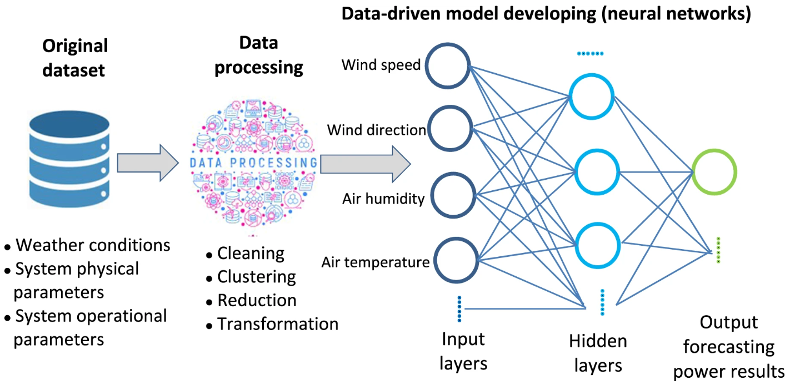
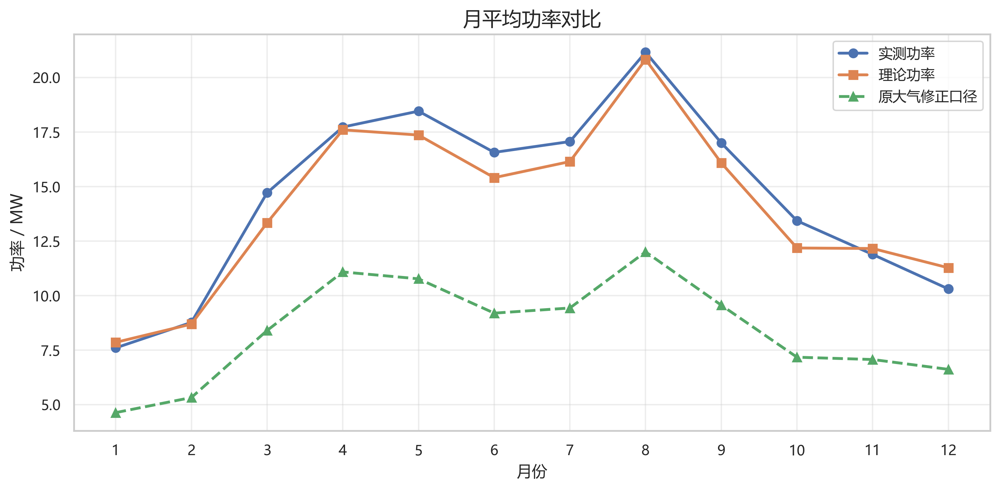
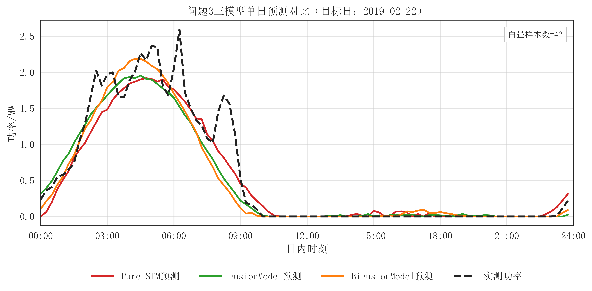
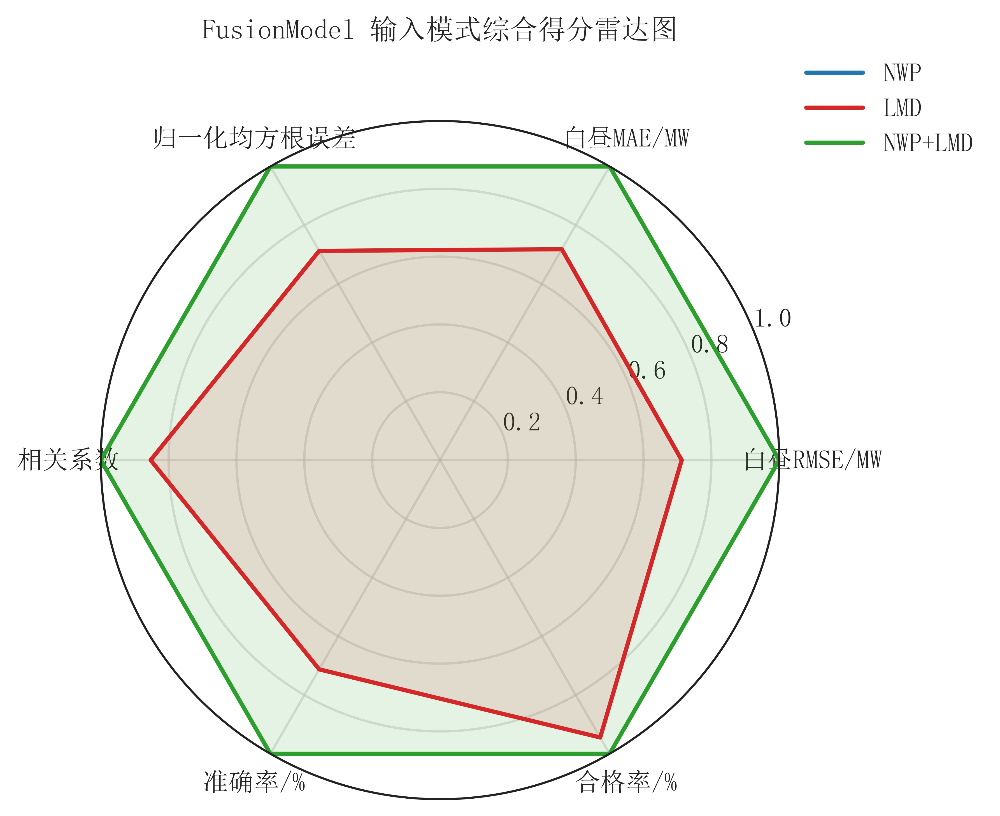

# 光伏电站日前功率预测与运行工作台项目主报告

| 项目 | 内容 |
| --- | --- |
| 课程名称 | 人工智能基础B |
| 项目名称 | 光伏电站日前功率预测与运行工作台 |
| 专业班级 | 电气工程及其自动化 2307 |
| 第一作者 | 王子成 |
| 第一作者学号 | 202310080241 |
| 团队成员 | 按课程平台最终名单填写，本报告先按职责分工列明 |
| 提交时间 | 2026 年 7 月 |

## 摘要

在新能源高比例并网背景下，光伏电站出力的不确定性会直接影响日前发电计划、备用容量安排和电网功率平衡。传统人工经验或单纯依赖历史功率的预测方法，在晴空稳定场景下能够给出大致趋势，但面对云量变化、辐照突变、湿度和温度耦合作用时，容易出现日内峰值偏移和局部时段误差放大。为了使预测结果真正服务于电气工程运行场景，本项目围绕光伏电站日前发电功率预测，构建了从站点机理诊断、历史功率基线、气象预报融合、运行场景归因到局地校正融合的完整工程链路，并将结果整理为可交互的 Streamlit 工作台和 GitHub Pages 静态展示页。

项目采用 Python 作为主体开发语言，使用 pandas、numpy、scikit-learn、PyTorch、Plotly 和 Streamlit 完成数据处理、深度学习建模、指标计算、图表展示和本地交互。模型侧比较 PureLSTM、FusionModel 和 BiFusionModel 等深度预测结构；数据侧使用历史功率、NWP 数值天气预报和 LMD 局地气象信息；评价侧按附件要求在白昼时段计算 `E_rmse`、`E_mae`、`E_me`、`r`、`C_R` 和 `Q_R`。当前结果表明，历史功率基线中 `FusionModel` 的 `E_rmse=0.0833`，加入 NWP 后降至 `0.0699`，mixed 局地校正输入进一步降至 `0.0465`，准确率达到 `95.35%`，合格率达到 `99.84%`。这说明多源气象信息对光伏日前预测具有稳定工程收益。

项目还补充了运行解读模块。该模块默认基于本地指标和运行摘要进行离线解释，可选接入兼容 HTTP 的语言接口，用于说明模型表现、结果差异和交付审查状态。为了保证课程演示稳定，系统默认不依赖远程接口，不在仓库中保存任何密钥。最终作品形成代码包、运行说明、测试表、视频脚本、课程交付清单和公开展示页，能够支撑教师复现和课程评分。

**关键词：** 光伏发电；日前预测；数值天气预报；深度学习；运行解读；Streamlit

## ABSTRACT

**PV Station Day-ahead Planning and Power Forecasting Workbench**

With the increasing penetration of renewable energy, photovoltaic power uncertainty has a direct impact on day-ahead generation scheduling, reserve arrangement, and grid power balance. Traditional empirical forecasting or models relying only on historical power can describe the general trend under stable clear-sky conditions, but they often suffer from peak deviation and local error amplification when cloud cover, irradiance, humidity, and temperature change rapidly. This project builds an engineering-oriented day-ahead photovoltaic power forecasting workflow that includes station mechanism diagnosis, historical-power baseline modeling, numerical weather prediction fusion, operating-scenario attribution, and local meteorological correction. The results are integrated into a Streamlit workbench and a static GitHub Pages project site.

The project is implemented mainly in Python. pandas, numpy, scikit-learn, PyTorch, Plotly, and Streamlit are used for data processing, deep-learning modeling, metric calculation, visualization, and local interaction. PureLSTM, FusionModel, and BiFusionModel are compared under different input settings. The evaluation follows the assignment appendix and calculates daylight metrics including `E_rmse`, `E_mae`, `E_me`, `r`, `C_R`, and `Q_R`. The current best result is achieved by `FusionModel_mixed`, with `E_rmse=0.0465`, `C_R=95.35%`, and `Q_R=99.84%`. These results show that multi-source meteorological information improves day-ahead photovoltaic forecasting in a stable and explainable way.

**Key words:** photovoltaic power; day-ahead forecasting; numerical weather prediction; deep learning; operation interpretation; Streamlit

## 1. 项目概述

### 1.1 项目背景

光伏电站的发电功率主要由太阳辐照、温度、云量、湿度、风速、组件状态和站点地理条件共同决定。季节变化会带来长周期出力差异，云团遮挡和天气突变会带来分钟级到小时级波动。当光伏装机容量不断提高时，这类波动会传导到电网调度侧，使日前发电计划、备用容量安排和频率调节面临更高不确定性。

在实际工程中，调度部门并不只需要一个离线模型分数，而是需要一套可解释、可复现、可追溯的预测流程：数据来自哪里、模型如何训练、预测表是否满足 15 分钟分辨率、误差指标是否按白昼时段计算、结果图能否支持复盘、出现异常时系统能否兜底运行。基于这一要求，本项目把原始建模任务改写为“光伏电站日前功率预测与运行工作台”，重点服务发电计划编制、调度复盘和模型维护。

传统方案通常存在三类不足：第一，只依赖历史功率曲线时，模型容易延续前一日或相似日期的出力形态，对目标日天气变化响应不足；第二，粗分辨率气象预报难以完全描述电站局地云量和辐照扰动；第三，很多建模成果停留在论文或静态表格层面，缺少一键复现、运行解释和交互式展示入口。因此，本项目将深度学习预测、气象特征融合、运行解释和交付展示整合为一个面向课程项目和工程复盘的闭环系统。

### 1.2 项目目标与量化指标

项目目标包括四个层面：

1. 建立站点机理诊断流程，解释光伏出力的季节性、日内波动和理论功率偏差。
2. 建立历史功率基线模型，在缺少未来天气信息时提供可用预测下限。
3. 融合 NWP 与 LMD 气象信息，提高天气扰动场景下的日前预测精度。
4. 构建可运行的软件工作台和项目归档材料，使项目能够被复现、演示和审查。

量化目标采用附件指标口径：白昼时段 `E_rmse` 越低越好，`C_R` 和 `Q_R` 越高越好。当前最优链路为 `FusionModel_mixed`，`E_rmse=0.0465`，`C_R=95.35%`，`Q_R=99.84%`，已经形成较好的工程演示效果。

### 1.3 团队分工

按照课程通知要求，项目报告需要覆盖方案设计、算法建模、代码开发、报告撰写、视频录制和成果交付等全流程职责。当前先不填写其他团队成员姓名和学号，分工按角色列明如下，正式提交时可将“成员A/B/C”替换为课程平台最终名单。

| 角色 | 主要职责 | 交付成果 |
| --- | --- | --- |
| 项目负责人与集成负责人 | 统筹选题、需求拆解、仓库整理、总控脚本、Pages 发布、交付清单和最终上传；负责把算法结果组织成工程化项目。 | `README.md`、`PROJECT_LOG.md`、`2025/run_project.py`、GitHub Pages、最终提交包清单。 |
| 数据与算法建模负责人 | 负责历史功率、NWP、LMD 数据整理，训练测试划分，理论功率诊断，PureLSTM/FusionModel/BiFusionModel 训练与指标核对。 | `02_problem_solutions/*/outputs/`、模型权重、预测表、指标 CSV、运行摘要。 |
| 界面展示与运行解读负责人 | 负责 Streamlit 工作台、运行解读模块、交互页面、代码入口、交付引用和训练控制页面设计。 | `2025/app.py`、`2025/llm/`、`docs/index.html`、网站使用指南。 |
| 报告测试与视频交付负责人 | 负责课程主报告、功能测试表、稳定性测试、演示视频脚本、打包策略和提交前验证。 | `05_delivery/项目主报告_终稿.*`、`功能性能稳定性测试表.md`、`演示视频脚本.md`。 |

## 2. 总体方案设计

### 2.1 系统架构

项目整体架构按从数据到交付的运行链路展开。首先将课程题面和附件指标转换为数据字段、评价口径和复现约束；随后完成历史功率、NWP、LMD 与站点信息整理，建立理论功率诊断和历史功率基线；在此基础上训练深度学习日前预测模型，逐步引入粗尺度数值天气预报和局地气象修正；最后把指标、图表、运行解释、复现命令和公开展示页整合到 Streamlit 工作台与项目归档材料中。

系统没有把结果简单写成静态总结，而是保留了完整的可运行路径。`2025/run_project.py` 提供总控入口；`2025/02_problem_solutions/` 保存正式链路代码；每条链路将输出写入 `outputs/predictions/`、`outputs/metrics/`、`outputs/figures/` 和 `outputs/reports/`；`2025/app.py` 读取这些产物，形成面向演示和复盘的工作台。



### 2.2 技术选型

Python 用于主流程开发，原因是其在数据处理、深度学习和可视化方面生态成熟。pandas 与 numpy 负责表格和时间序列处理；scikit-learn 用于预处理、归一化和部分传统分析；PyTorch 用于深度学习模型训练和 checkpoint 保存；matplotlib、seaborn 与 Plotly 负责静态和交互图；Streamlit 用于快速构建本地工作台。

模型层选择 LSTM 及融合结构，是因为光伏日前预测本质上是时间序列回归问题，既有日内连续变化，也有天气输入对目标日曲线的调制作用。项目比较 PureLSTM、FusionModel 和 BiFusionModel，避免只展示单一模型。语言接口采用“离线规则兜底 + 可选兼容 HTTP”的方式，是为了满足课程对大模型模块的要求，同时保证无密钥、断网或远程接口失败时仍能演示。

### 2.3 模块划分

| 模块 | 主要路径 | 作用 |
| --- | --- | --- |
| 数据与机理诊断 | `problem1_data_analysis` | 计算理论功率、分析月度变化、典型日曲线和偏差分布。 |
| 历史功率基线 | `problem2_baseline_forecasting` | 用历史功率序列建立日前预测基线。 |
| 气象预报融合 | `problem3_scenario_analysis` | 加入目标日 NWP，提高天气扰动场景预测能力。 |
| 运行场景归因 | `problem3_scenario_analysis` 二次分析脚本 | 解释不同天气和特征条件下的误差变化。 |
| 局地校正融合 | `problem4_feature_ablation` | 比较 NWP、LMD 和 mixed 输入，评估空间降尺度价值。 |
| 运行解读 | `2025/llm` | 基于指标和运行摘要生成解释，支持离线和可选远程接口。 |
| 交互工作台 | `2025/app.py` | 展示结果、图表、引用材料、代码入口和训练控制。 |
| 测试与维护 | `tools/`、`tests/`、`PROJECT_LOG.md` | 做健康检查、回归测试和修改记录。 |

## 3. 详细实现过程

### 3.1 数据模块

项目数据包含光伏电站历史功率、NWP 数值天气预报、LMD 局地气象信息和站点地理/装机信息。题面要求时间分辨率为 15 分钟，测试集为第 2、5、8、11 个月最后一周，误差统计仅限白昼时段。当前代码遵守这一口径：预测表中起报时间为目标日前一日 00:00，预报时间覆盖目标日 96 个 15 分钟点。

数据预处理包括时间戳解析、缺失值处理、功率归一化、训练集和测试集划分、天气特征对齐、白昼样本掩码生成等。归一化参数只在训练集拟合，避免测试集信息泄漏。所有正式链路输出都写入对应 `outputs/` 目录，便于报告引用和后续复盘。

### 3.2 站点机理诊断

站点机理诊断用于回答“为什么光伏功率会这样变化”。项目基于辐照换算、温度修正和装机容量上限计算理论可发功率，并与实际功率进行对比。当前推荐口径 `P_theo` 的白昼 RMSE 为 7.0769 MW，相关系数为 0.9645，说明理论功率可以解释大部分出力变化。但误差分布仍显示实际运行受到云量、局地遮挡、组件温度和设备状态等因素影响。



该模块的价值在于把深度学习预测放回电气工程场景中理解。模型不是孤立拟合曲线，而是在物理出力规律、季节性和日内波动基础上进一步处理复杂天气扰动。

### 3.3 深度学习预测模型

历史功率基线链路比较了 PureLSTM、FusionModel 和 BiFusionModel。PureLSTM 强调序列记忆，FusionModel 融合时序和辅助信息，BiFusionModel 进一步增强双向或组合特征表达。当前历史功率基线中 `FusionModel` 表现最好，`E_rmse=0.0833`，`C_R=91.67%`，`Q_R=98.07%`。

加入 NWP 后，模型输入不再只依赖过去功率，而是融合目标日天气条件。当前气象预报融合链路中 `FusionModel` 的 `E_rmse=0.0699`，`C_R=93.01%`，`Q_R=99.76%`。与历史功率基线相比，归一化均方根误差降低约 16.0%，说明 NWP 对日前预测具有实际增益。



局地校正融合链路比较 NWP、LMD 和 mixed 输入。结果显示 `FusionModel_mixed` 最优，`E_rmse=0.0465`，`C_R=95.35%`，`Q_R=99.84%`。这说明更贴近电站局部环境的气象信息能够补足粗尺度预报的不足，尤其适合云量变化和辐照波动明显的运行场景。



### 3.4 指标计算

项目按附件要求只在白昼时段计算预测误差。核心指标包括 `E_rmse`、`E_mae`、`E_me`、`r`、`C_R` 和 `Q_R`。这些指标由共享工具函数计算，避免不同链路各算各的。指标 CSV 可直接在工作台查看，也可用于报告表格。

| 链路 | 模型或口径 | `E_rmse` | `C_R` | `Q_R` | 工程含义 |
| --- | --- | ---: | ---: | ---: | --- |
| 历史功率基线 | `FusionModel` | 0.0833 | 91.67% | 98.07% | 无未来气象预报时的保底预测链路。 |
| 气象预报融合 | `FusionModel` | 0.0699 | 93.01% | 99.76% | 引入目标日 NWP 后提升日前计划精度。 |
| 局地校正融合 | `FusionModel_mixed` | 0.0465 | 95.35% | 99.84% | 局地气象信息补足粗尺度预报误差。 |

### 3.5 大模型与运行解读模块

运行解读模块位于 `2025/llm/`。它读取各链路的 `run_summary.json` 和指标 CSV，形成结构化上下文。默认情况下，模块使用离线规则生成解释，例如说明为什么 mixed 输入表现更好、NWP 融合在哪些场景更有价值、当前交付审查还缺哪些材料。若本机配置了兼容 HTTP 接口，也可以使用远程语言模型增强表达。

该设计兼顾课程要求和演示稳定性。项目不会把密钥写入仓库，远程调用失败也不会影响工作台运行。报告和视频中强调语言接口用于运行解释和交付复盘，而不是替代模型训练或伪造结果。

### 3.6 界面与交互模块

Streamlit 工作台是项目面向教师复现和视频演示的主入口。页面包括工作台、运行结果、交付引用、代码与命令、运行解读和训练控制。工作台不使用题号式导航，而使用工程链路和运行视角组织信息，避免像“题目答案拼接”。训练控制页默认只查看已有输出或 dry-run 预演，真正运行训练前需要显式确认，并通过后台日志展示 Epoch 进度、checkpoint 复用和停止/继续状态，降低误操作风险。

GitHub Pages 静态页用于公开展示项目摘要、核心指标、图表和本地运行命令。由于 Pages 不能运行 Python，页面中明确说明完整交互需本地启动 Streamlit 工作台。

## 4. 测试与结果分析

### 4.1 功能测试

项目提供了多层测试：`python -m py_compile` 检查核心 Python 文件语法；`python 2025/tools/project_health_check.py` 检查 Python 解析、受管输出和输入路径；`python -m unittest discover -s tests -q` 执行回归测试；`python 2025/run_project.py --show all` 读取已有输出，确认摘要和指标存在；Streamlit 工作台与 Pages 页面用于视觉和交互检查。

| 测试项 | 测试命令或入口 | 预期结果 |
| --- | --- | --- |
| 核心文件语法检查 | `python -m py_compile 2025\app.py 2025\run_project.py 2025\llm\assistant.py` | 核心入口均能解析。 |
| 项目健康检查 | `python 2025\tools\project_health_check.py` | 无 Python 解析错误和受管输出问题。 |
| 单元测试 | `python -m unittest discover -s tests -q` | 回归测试全部通过。 |
| 已有输出读取 | `python 2025\run_project.py --show all` | 五条工程链路已有输出可读取。 |
| 本地交互界面 | `python -m streamlit run 2025\app.py` | 工作台可打开并切换页面。 |
| 双击启动 | `2025\start_software.vbs` | 桌面启动器可打开软件界面。 |

### 4.2 结果对比与分析

结果表明，随着输入信息从历史功率扩展到 NWP，再扩展到 mixed 局地校正输入，预测误差持续下降。历史功率基线是必要兜底，NWP 提供目标日天气信息，mixed 输入则进一步增强局地气象表达。这一趋势符合光伏出力的物理规律，也符合工程运维对多源数据接入的预期。

| 对比项 | 结果 |
| --- | --- |
| NWP 融合相对历史功率基线 | `E_rmse` 从 0.0833 降至 0.0699，约降低 16.0%。 |
| mixed 输入相对纯 NWP 输入 | `E_rmse` 从 0.0879 降至 0.0465，约降低 47.1%。 |
| 最优链路 | `FusionModel_mixed`，`C_R=95.35%`，`Q_R=99.84%`。 |

### 4.3 稳定性设计

项目的稳定性设计主要体现在四个方面。第一，模型 checkpoint 可复用，避免每次演示都长时间重训。第二，运行解读有离线兜底，避免 API 问题影响展示。第三，启动器和 `run.bat` 提供一键入口，降低教师复现门槛。第四，受控运行页避免误触发长时间训练，所有重要输出都有 `run_summary.json` 追溯。

| 稳定性场景 | 设计措施 | 效果 |
| --- | --- | --- |
| 远程语言接口不可用 | 离线规则兜底 | 工作台仍能解释指标和交付状态。 |
| 用户误运行 `python 2025\app.py` | 输出正确启动提示 | 避免 Streamlit bare mode 警告误导。 |
| 演示时不希望重训 | 默认读取已有 `outputs/` | 视频展示更稳定。 |
| 长路径与中文路径 | 统一路径工具与 Git longpaths | 当前 Windows 项目路径可运行。 |

## 5. 总结与展望

本项目完成了一个从数据、模型、指标、图表到工作台展示的光伏日前预测工程闭环。与只提交静态论文相比，当前作品能够被启动、被检查、被复盘，也能够在公开 Pages 中展示主要结论。模型结果显示，多源气象信息确实能提升光伏日前预测精度，尤其是 mixed 局地校正输入在当前站点上表现最好。

开发过程中遇到的主要难点包括时间对齐、训练测试划分、白昼指标口径、预测表格式、模型复用和展示稳定性。项目通过统一路径工具、输出管理器、checkpoint 签名、健康检查和工作台页面逐步解决这些问题。为了避免最终作品带有明显“生成式总结”观感，项目展示层改用工程角色和运行链路叙事，把结果放在调度计划、运行复盘和模型维护场景中解释。

项目仍有改进空间。数据方面，可以接入更多站点和更长时间跨度，提高模型泛化性。模型方面，可以加入概率预测、分位数回归或不确定性估计，为调度侧提供风险区间。工程方面，可以把 Streamlit 工作台进一步部署到云端，接入定时数据更新和在线误差监控。运维方面，可以增加异常天气告警和预测偏差自动归因，使系统从课程项目进一步走向实际运行辅助工具。

## 附录 A：复现命令

```powershell
pip install -r 2025\requirements.txt
python 2025\tools\project_health_check.py
python -m unittest discover -s tests -q
python 2025\run_project.py --show all
python -m streamlit run 2025\app.py
```

## 附录 B：项目链接

GitHub 仓库：`https://github.com/wzgig/ai-foundations-b-pv-forecasting`

GitHub Pages：`https://wzgig.github.io/ai-foundations-b-pv-forecasting/`
